# Du MCD au MLD

## Définitions

- MCD  
  *Modèle conceptuel de données*
  Étape de **réflexion générale sur les données**. Il n'y a pas de notion technique dans le MCD.
- MLD  
  *Modèle logique de données*
  Passage de la réflexion générale sur les données à la réflexion sur la **mise en œuvre technique**.

## Exemple

### Brief application

Prenons un exemple d'application :

> - un logiciel qui permet d'enregistrer des contacts
> - le cahier des charges indique :
>   - un contact possède un prénom et un nom
>   - un contact peut avoir zéro, un ou plusieurs numéros de téléphone (on peut avoir un contact sans connaître son / ses numéros)
>   - un numéro de téléphone n'est lié qu'à un seul contact, on ne peut pas avoir de numéro non attribué
>   - une personne peut être dans une seule catégorie (ex : perso, boulot...)
>   - une catégorie peut contenir zéro ou plusieurs personnes

### Déterminer les entités

On peut déduire les entités :

- **CONTACT**
- **TÉLÉPHONE**
- **CATÉGORIE**

*Note : **TÉLÉPHONE** représente un numéro de téléphone.*

### Déterminer les propriétés

Pour chaque entité, on recherche les propriétés :

- **CONTACT** (prénom, nom)
- **TÉLÉPHONE** (numéro)
- **CATÉGORIE** (titre)

### Déterminer les indifentifiants des entités

- **CONTACT** : le prénom et le nom peuvent être portés par plusieurs personnes, on ajoute un code contact
- **TÉLÉPHONE** : un numéro de téléphone est unique, ça peut être l'identifiant de l'entité
- **CATÉGORIE** : le titre de la catégorie peut être unique, ça peut être l'identifiant de l'entité

On obtient donc les entités complètes :

- **CONTACT** (<u>code contact</u>, prénom, nom)
- **TÉLÉPHONE** (<u>numéro</u>)
- **CATÉGORIE** (<u>titre</u>)

### Déterminer les relations

- un **CONTACT** *possède* ***au minimum 0*** et ***au maximum une infinité*** de numéros de **TÉLÉPHONE**
- un numéro de **TÉLÉPHONE** *est possédé* par ***au minimum 1*** et ***au maximum 1*** **CONTACT**
- un **CONTACT** *est classé* dans ***au minimum 0*** et ***au maximum 1*** **CATÉGORIE**
- une **CATÉGORIE** *permet de classer* ***au minimum 0*** et ***au maximum une infinité*** de **CONTACT**

### Schéma

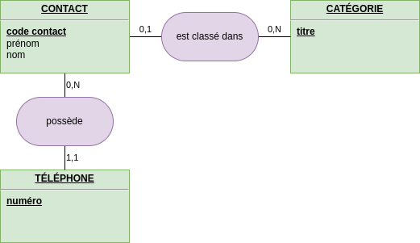

#### Lecture du MCD

**Entre CONTACT et CATÉGORIE**

un **CONTACT** *est classé dans*...

---

un **CONTACT** *est classé dans* ***zéro ou une***...

---

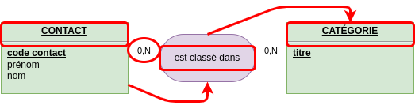

un **CONTACT** *est classé dans* ***zéro ou une*** **CATÉGORIE**.

---

**Entre CATÉGORIE et CONTACT**

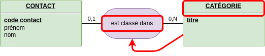

une **CATÉGORIE** *classe*...

---

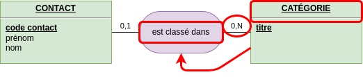

une **CATÉGORIE** *classe* ***zéro ou plusieurs***...

---

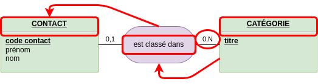

une **CATÉGORIE** *classe* ***zéro ou plusieurs*** **CONTACT**.

### Entités vers tables

Règles de base :

- chaque entité du MCD va devenir une table du MLD
- chaque propriété du MCD va devenir un champ d'une table du MLD
- on utilise généralement un identifiant spécifique comme clé primaire d'une table du MLD

| MCD | MLD |
| --- | --- |
|  | 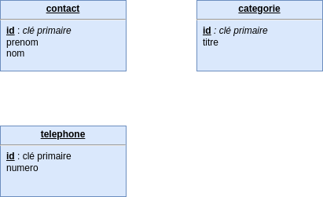 |

#### Ajouts techniques

Le MLD est une préparation à la mise en œuvre technique, on peut donc ajouter des champs techniques comme :

- `created_at` : date de création d'un enregistrement
- `updated_at` : date de modification d'un enregistrement

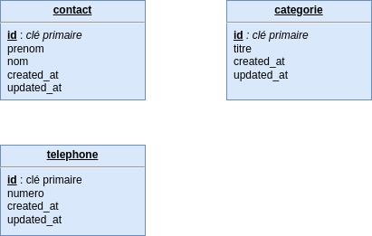

### Types et spécificités

Le MLD est une préparation à la mise en œuvre technique, on va indiquer les types de données des champs et leurs spécificités.

Ces informations sont indiquées dans le dictionnaire de données.

Dans le projet exemple on va nommer les tables et champs en anglais.

#### Table contact

Le champ `lastname` est lié au besoin du projet.  
Il correspond à la propriété nom de l'entité **CONTACT** du MCD.  
La longueur d'un nom de famille est variable : type `VARCHAR`.  
On détermine la longueur du champ avec le client, en se renseignant...  
Ici le champ est obligatoire (`NOT NULL`) : **c'est une règle métier qui doit être validée par le client**.

| Champ | Type | spécificités | Description |
| ---   | ---  | ---          | ---         |
| `id` | INT | PRIMARY | INT GENERATED ALWAYS AS IDENTITY PRIMARY KEY | Identifiant unique d'un enregistrement |
| `firstname` | VARCHAR(64) | | NULL | Prénom du contact |
| `lastname` | VARCHAR(64) | NOT NULL | Nom de famille du contact |
| `created_at` | TIMESTAMPTZ | NOT NULL default(NOW()) | Date de création de l'enregistrement (du contact) |
| `updated_at` | TIMESTAMPTZ | NULL | Date de dernière modification de l'enregistrement (du contact) |

#### Table category

Le champ `title` est lié au besoin du projet.  
Il correspond à la propriété titre de l'entité **CATÉGORIE** du MCD.
On indique que le champ est obligatoire (`NOT NULL`) et qu'il ne peut y avoir qu'une seule catégorie de même titre (`UNIQUE`) : **ce sont des règles métier qui doivent être validées par le client**.

| Champ | Type | spécificités | Description |
| ---   | ---  | ---          | ---         |
| `id` |INT |  INT GENERATED ALWAYS AS IDENTITY PRIMARY KEY  | Identifiant unique d'un enregistrement |
| `title` |VARCHAR(32) | NOT NULL, UNIQUE | Titre de la catégorie |
| `created_at` |TIMESTAMPTZ | NOT | NOT NULL default(NOW()) | Date de création de l'enregistrement (de la catégorie) |
| `updated_at` |TIMESTAMPTZ | NULL | Date de dernière modification de l'enregistrement (de la catégorie) |

#### Table phone

Le champ ̀ number` est lié au besoin du projet.  
Il correspond à la propriété numéro de l'entité **TÉLÉPHONE** du MCD.  
Quel type de données choisir pour un numéro de téléphone ? un VARCHAR !  
Si on enregistre le numéro 0123456 sous forme d'un entier, le SGBD enregistrera 123456 car le 0 n'est pas significatif pour un nombre (01 == 1).  
Un numéro de téléphone est donc bien une chaîne de caractères. On peut également avoir des préfixes (ex : +33), et d'éventuels autres caractères (".", "-", " ").  
Pour connaître la longueur maximum, on peut se référer à la documentation ([Procédures de numérotation, à partir de la page 3](https://www.itu.int/dms_pub/itu-t/opb/sp/T-SP-E.164C-2011-PDF-F.pdf)).  
Pour avoir de la marge, on prend une longueur de 24 octets.  
On indique enfin que le champ est obligatoire (NOT NULL) et UNIQUE (qui correspond à la règle "un numéro de téléphone n'est lié qu'à un seul contact").  
Note : dans le code du logiciel on peut prévoir de faire du nettoyage, par exemple supprimer les espaces multiples ("01   02" => "01 02").

| Champ | Type | spécificités | Description |
| ---   | ---  | ---          | ---         |
| `id` |INT |  INT GENERATED ALWAYS AS IDENTITY PRIMARY KEY  | Identifiant unique d'un enregistrement |
| `number` | VARCHAR(24) | NOT NULL, UNIQUE | Numéro de téléphone
| `created_at` |TIMESTAMPTZ | NOT | NOT NULL default(NOW()) | Date de création de l'enregistrement Date de création de l'enregistrement (du numéro de téléphone)
| `updated_at` |TIMESTAMPTZ | NULL | Date de dernière modification de l'enregistrement (du numéro de téléphone)

### Les relations

Le principe général pour mettre en place une relation est de faire correspondre un champ d'une table à la clé primaire de la table avec laquelle elle a une relation.

C'est la notion de **clé étrangère**.

Regardons la relation **CONTACT-CATÉGORIE** :

- un **CONTACT** *est classé* dans ***0 ou 1*** **CATÉGORIE**
- une **CATÉGORIE** *classe* ***0 ou plusieurs*** **CONTACT**
- 
Où placer la clé étrangère dans le MLD ?

- si on la place dans la table `contact`, alors une entité **CONTACT** pourra avoir une référence (un lien / une relation) vers une entité **CATÉGORIE** :  
  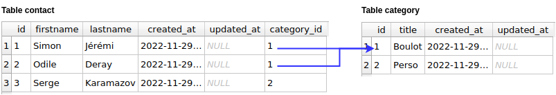
- si on la place dans la table `category`, alors une entité **CATÉGORIE** pourra voir une référence (lien / relation) vers une entité **CONTACT** :  
  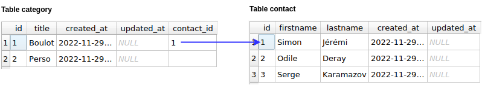

Pour la relation **CONTACT-CATÉGORIE** on va donc :

- créer un champ `category_id` dans la table `contact`
- créer une clé étrangère du champ `contact.category_id` vers le champ `category.id`

Et pour la relation **CONTACT-TÉLÉPHONE** ?

Le MCD indique que :

- un **CONTACT** *peut avoir* ***0 ou plusieurs*** **TÉLÉPHONE**
- un **TÉLÉPHONE** *est lié* à ***au moins 1 et maximum 1*** **CONTACT**

Donc la clé étrangère doit être dans la table `phone` et référencer le champ `contact.id`.

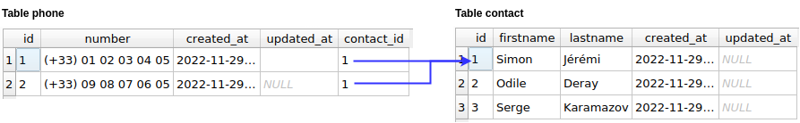

### DDD complet

#### Table contact

| Champ | Type | spécificités | Description |
| ---   | ---  | ---          | ---         |
| `id` | INT | PRIMARY | INT GENERATED ALWAYS AS IDENTITY PRIMARY KEY | Identifiant unique d'un enregistrement |
| `firstname` | VARCHAR(64) | | NULL | Prénom du contact |
| `lastname` | VARCHAR(64) | NOT NULL | Nom de famille du contact |
| `created_at` | TIMESTAMPTZ | NOT NULL default(NOW()) | Date de création de l'enregistrement (du contact) |
| `updated_at` | TIMESTAMPTZ | NULL | Date de dernière modification de l'enregistrement (du contact) |
| `category_id` | INT | NULL, UNSIGNED, REFERENCES (`category.id`) | Identifiant de la catégorie à laquelle est rataché le contact |

#### Table category

| Champ | Type | spécificités | Description |
| ---   | ---  | ---          | ---         |
| `id` |INT |  INT GENERATED ALWAYS AS IDENTITY PRIMARY KEY  | Identifiant unique d'un enregistrement |
| `title` |VARCHAR(32) | NOT NULL, UNIQUE | Titre de la catégorie |
| `created_at` |TIMESTAMPTZ | NOT | NOT NULL default(NOW()) | Date de création de l'enregistrement (de la catégorie) |
| `updated_at` |TIMESTAMPTZ | NULL | Date de dernière modification de l'enregistrement (de la catégorie) |

#### Table phone

| Champ | Type | spécificités | Description |
| ---   | ---  | ---          | ---         |
| `id` |INT |  INT GENERATED ALWAYS AS IDENTITY PRIMARY KEY  | Identifiant unique d'un enregistrement |
| `number` | VARCHAR(24) | NOT NULL, UNIQUE | Numéro de téléphone
| `created_at` |TIMESTAMPTZ | NOT | NOT NULL default(NOW()) | Date de création de l'enregistrement Date de création de l'enregistrement (du numéro de téléphone)
| `updated_at` |TIMESTAMPTZ | NULL | Date de dernière modification de l'enregistrement (du numéro de téléphone)
| `contact_id` | INT | NOT NULL, UNSIGNED, REFERENCES (`contact.id`) | Identifiant du contact auquel est rataché le téléphone |

### Schéma MLD

À partir des travaux précédents, on peut donc terminer le MLD complet :

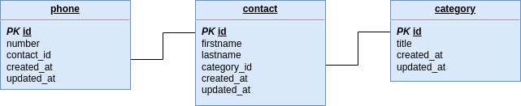